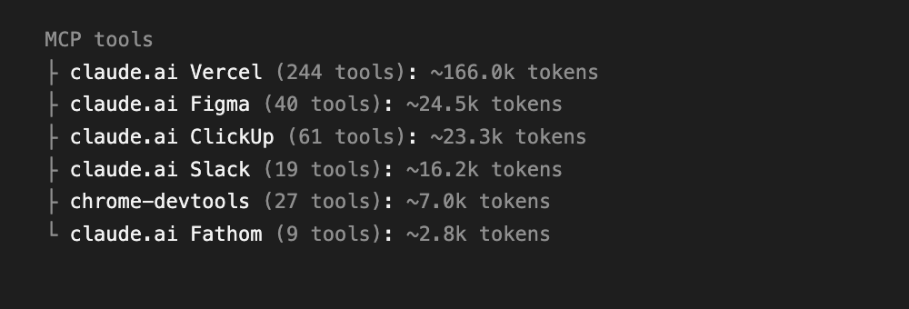

# Custom connectors for Claude Code

Seven Claude Code skills that replace the **Slack, Fathom, ClickUp, Vercel, AWS and Chrome DevTools**
MCPs, and the reading side of the **Figma** MCP. Claude calls each app's API directly with `curl` (or the `aws`
CLI), using your own login saved in your Mac's Keychain.

## Install (2 commands, inside Claude Code)

```
/plugin marketplace add prathambhatia/custom-connectors
/plugin install custom-connectors@custom-connectors
```

Start a new session and you're done. Nothing runs at install time: the skills are just
instructions Claude reads when you ask for that app. The files live in
`~/.claude/plugins/` on your Mac, not in any of your project repos.

**Then turn off the MCPs these replace**, otherwise they keep loading their tools every session.
Type `/mcp`, pick each of Slack, Fathom, ClickUp, Vercel, AWS and chrome-devtools, and disable it. Connectors added
through claude.ai are under claude.ai, Settings, Connectors. **Keep the Figma MCP** if you edit
designs or use design-to-code; the Figma connector only reads.

Update later with `/plugin marketplace update custom-connectors`.

## Optional: make Claude always pick the connectors

If you keep any of these MCPs switched on, Claude might occasionally use an MCP tool instead of the
connector. To rule that out, add this line to your global `~/.claude/CLAUDE.md`:

```
For Slack, Fathom, ClickUp, Vercel, AWS and Chrome DevTools, use the custom-connectors skills instead of the MCPs.
For Figma, use figma-connector for reading, and the Figma MCP only for editing or design-to-code.
```

You don't need this if you've disabled the MCPs with `/mcp`.

## What each one does

| Connector | What Claude can do |
|---|---|
| **slack-connector** | Send, reply in threads, DM, edit, delete, upload files, read channels and threads, search messages, find channels and people, react, read profiles |
| **fathom-connector** | List your meetings, find one by title, person, company or date, get the summary, transcript and action items, search what was said across calls |
| **clickup-connector** | Create, update, search and delete tasks, comments, tags, checklists, attachments, custom fields, subtasks and time entries |
| **vercel-connector** | Deploy, redeploy, check status, read build and live runtime logs, manage env vars, promote or roll back, list domains. No Vercel CLI needed |
| **aws-connector** | SSO login, SSM tunnels to private databases, Run Command, Parameter Store, logs and Logs Insights, ECS, RDS, Secrets Manager, S3, CloudFront, Lambda, costs, and anything else the aws CLI can do |
| **chrome-devtools-connector** | Drive Chrome: open pages, click, fill forms, type, upload files, screenshots, snapshots, console and network logs, run JS, emulate devices, Lighthouse. Same official chrome-devtools-mcp under the hood, started on first use; no token |
| **figma-connector** | Read pages, frames and node details, render frames to PNG/SVG, version history, read and post comments. **Read-only** |

## Why this beats the MCPs

**An MCP loads every one of its tools into every session**, whether you use them or not. A connector
loads one line until you ask for that app.

<table>
<tr><th>Before: 6 MCPs, ~239.8k tokens (24.0%)</th><th>After: 7 connectors, ~915 tokens (0.09%)</th></tr>
<tr><td></td>
<td></td></tr>
</table>


| App | MCP tools | **Before**: MCP tokens | of 1M | **After**: connector tokens | of 1M |
|---|---|---|---|---|---|
| Vercel | 244 | 166.0k | **16.6%** | ~140 | **0.014%** |
| Figma | 40 | 24.5k | **2.5%** | ~150 | **0.015%** |
| ClickUp | 61 | 23.3k | **2.3%** | ~130 | **0.013%** |
| Slack | 19 | 16.2k | **1.6%** | ~90 | **0.009%** |
| Chrome DevTools | 27 | 7.0k | **0.7%** | ~120 | **0.012%** |
| Fathom | 9 | 2.8k | **0.3%** | ~140 | **0.014%** |
| **Total** | **400** | **239.8k** | **24.0%** | **~770** | **0.077%** |

**Before 24.0% → after 0.077% of a 1M context, about 311× smaller.** All numbers are measured:
"before" is each MCP's tools added up from Claude Code's `/context`, "after" is from
`claude plugin details`. The AWS connector adds ~150 more (there's no AWS MCP to compare), for ~915
total, and using a connector adds 1k–2k for that session only.

Run `/context` before and after to see your own numbers.

- **Faster:** no MCP server in between, Claude calls the app's API directly.
- **Acts as you:** your own token, so messages and comments show your name.
- **Works on any Claude account:** your logins live in your Mac's Keychain.

## First use

Just ask Claude to do something on that app. The first time, it asks for one thing:

| App | What it asks for |
|---|---|
| Slack | Open https://app.slack.com in Chrome and sign in. Claude reads your session from Chrome (click **Allow** when macOS asks about "Chrome Safe Storage") |
| Fathom | API key from https://fathom.video/customize#api-access-header |
| ClickUp | Personal token from https://app.clickup.com/settings/apps |
| Vercel | Token from https://vercel.com/account/settings/tokens |
| Figma | Personal access token from Figma, Settings, Security |
| Chrome DevTools | Nothing. Needs Node.js; the first browser request starts it and opens its own Chrome window |
| AWS | Nothing if you already use the `aws` CLI with SSO; otherwise your SSO start URL |

Tokens go into your Keychain and never leave your Mac. This repo contains no credentials.

## Without the plugin system

```bash
curl -fsSL https://raw.githubusercontent.com/prathambhatia/custom-connectors/main/install.sh | bash
```

Copies the seven skills into `~/.claude/skills/`. Read the script first if you prefer. Use one way or
the other, not both, or every skill shows up twice.

## Limits

- **Mac only.** Logins live in the macOS Keychain, and Slack setup reads from Google Chrome.
- **Slack can't schedule messages** with a browser session token. Schedule from the Slack app.
- **Vercel runtime logs are live only.** Old logs are in the Vercel dashboard.
- **Figma is read-only.** No editing or design-to-code.
- **AWS writes to production always ask twice** before running.
- **Chrome DevTools opens its own Chrome window** (separate profile), like the normal MCP. To drive your
  everyday Chrome, see the skill's `--autoConnect` note.
- Needs `curl`, `jq` and `python3` (`brew install jq` if `jq` is missing), plus the `aws` CLI for AWS.
