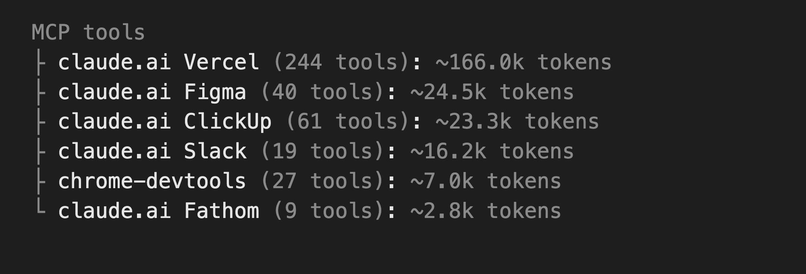
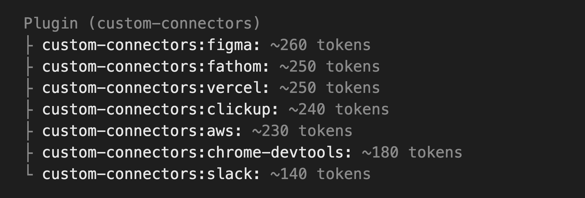
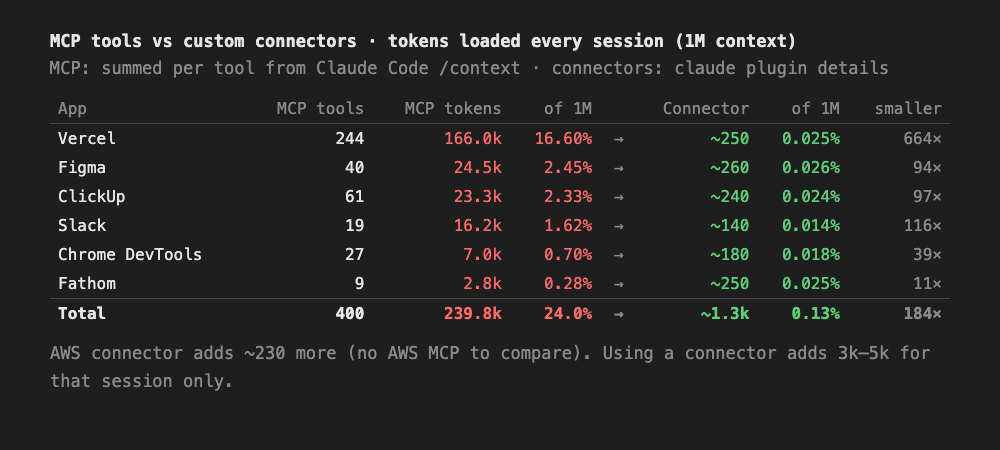

# Custom connectors for Claude Code

Seven Claude Code skills that replace the **Slack, Fathom, ClickUp, Vercel, AWS and Chrome DevTools**
MCPs, and the reading side of the **Figma** MCP. Claude calls each app's API directly with `curl` (or the `aws`
CLI), using your own login saved in your Mac's Keychain.

## Install (3 commands, inside Claude Code)

```
/plugin marketplace add prathambhatia/custom-connectors
/plugin install custom-connectors@custom-connectors
/reload-plugins
```

`/reload-plugins` loads the skills into the session you're in (new sessions get them automatically;
any other session already open needs it too, or a restart). Nothing runs at install time: the skills are just
instructions Claude reads when you ask for that app. The files live in
`~/.claude/plugins/` on your Mac, not in any of your project repos.

**Then turn off the MCPs these replace**, otherwise they keep loading their tools every session.
Type `/mcp`, pick each of Slack, Fathom, ClickUp, Vercel, AWS and chrome-devtools, and disable it. Connectors added
through claude.ai are under claude.ai, Settings, Connectors. **Keep the Figma MCP** if you edit
designs or use design-to-code; the Figma connector only reads.

### Updating

Updates don't arrive on their own. To get the latest version, run inside Claude Code:

```
/plugin marketplace update custom-connectors
/plugin update custom-connectors@custom-connectors
/reload-plugins
```

 `/plugin` shows the installed version.

Skills show as `custom-connectors:slack`, `:fathom`, `:clickup`, `:vercel`, `:aws`, `:figma` and `:chrome-devtools`
(before v1.2.0 they ended in `-connector`).

## Optional: make Claude always pick the connectors

If you keep any of these MCPs switched on, Claude might occasionally use an MCP tool instead of the
connector. To rule that out, add this line to your global `~/.claude/CLAUDE.md`:

```
For Slack, Fathom, ClickUp, Vercel, AWS and Chrome DevTools, use the custom-connectors skills instead of the MCPs.
For Figma, use figma for reading, and the Figma MCP only for editing or design-to-code.
```

You don't need this if you've disabled the MCPs with `/mcp`.

## What each one does

| Connector | What Claude can do |
|---|---|
| **slack** | Send, reply in threads, DM, edit, delete, upload files, read channels and threads, search messages, find channels and people, react, read profiles |
| **fathom** | List your meetings, find one by title, person, company or date, get the summary, transcript and action items, search what was said across calls |
| **clickup** | Create, update, search and delete tasks, comments, tags, checklists, attachments, custom fields, subtasks and time entries |
| **vercel** | Deploy, redeploy, check status, read build and live runtime logs, manage env vars, promote or roll back, list domains. No Vercel CLI needed |
| **aws** | SSO login, SSM tunnels to private databases, Run Command, Parameter Store, logs and Logs Insights, ECS, RDS, Secrets Manager, S3, CloudFront, Lambda, costs, and anything else the aws CLI can do |
| **chrome-devtools** | Drive Chrome: open pages, click, fill forms, type, upload files, screenshots, snapshots, console and network logs, run JS, emulate devices, Lighthouse. Same official chrome-devtools-mcp under the hood, started on first use; no token |
| **figma** | Read pages, frames and node details, render frames to PNG/SVG, version history, read and post comments. **Read-only** |

## Why this beats the MCPs

**An MCP loads every one of its tools into every session**, whether you use them or not. A connector
loads one line until you ask for that app.

<table>
<tr><th>Before: 6 MCPs, ~239.8k tokens (24.0%)</th><th>After: 7 connectors, ~1.5k tokens (0.15%)</th></tr>
<tr><td></td>
<td></td></tr>
</table>



| App | MCP tools | **Before**: MCP tokens | of 1M | **After**: connector tokens | of 1M |
|---|---|---|---|---|---|
| Vercel | 244 | 166.0k | **16.6%** | ~250 | **0.025%** |
| Figma | 40 | 24.5k | **2.5%** | ~260 | **0.026%** |
| ClickUp | 61 | 23.3k | **2.3%** | ~240 | **0.024%** |
| Slack | 19 | 16.2k | **1.6%** | ~140 | **0.014%** |
| Chrome DevTools | 27 | 7.0k | **0.7%** | ~180 | **0.018%** |
| Fathom | 9 | 2.8k | **0.3%** | ~250 | **0.025%** |
| **Total** | **400** | **239.8k** | **24.0%** | **~1.3k** | **0.13%** |

**Before 24.0% → after 0.13% of a 1M context, about 184× smaller.** All numbers are measured:
"before" is each MCP's tools added up from Claude Code's `/context`, "after" is from
`claude plugin details`. The AWS connector adds ~230 more (there's no AWS MCP to compare), for ~1.5k
total, and using a connector adds 3k–5k for that session only.

Run `/context` before and after to see your own numbers.

- **Faster:** no MCP server in between, Claude calls the app's API directly.
- **Acts as you:** your own token, so messages and comments show your name.
- **Works on any Claude account:** your logins live in your Mac's Keychain.

## Reliability (measured)

Each request below was run through a fresh Claude Code session with only this plugin installed and
every MCP switched off, then checked automatically: did the final answer contain the right fact, and
did any API call fail along the way.

| Connector | Runs | Task done | No failed call on the way |
|---|---|---|---|
| Fathom | 10 | 100% | 100% |
| AWS | 9 | 100% | 100% |
| Slack | 8 | 100% | 100% |
| ClickUp | 6 | 100% | 100% |
| Vercel | 6 | 100% | 100% |
| Figma | 6 | 100% | 100% |
| Chrome DevTools | 3 | 100% | 100% |
| **Total** | **48** | **100%** | **100%** |

The first round (44 runs) completed every task but had a failed call along the way in 6 of them
(**86%** clean). Those exposed 3 real bugs, all fixed in v1.1.1–1.1.2: the Chrome bridge killed its
own shell, Fathom's paging used fixed temp file names that collided between sessions, and Claude
invented an invalid AWS log filter that the skill now documents. The table shows the latest version.
It's a small sample (2 to 3 runs per request, 22 requests), so treat it as "solid", not "perfect":
expired logins and API changes can still make a call fail.

## First use

Just ask Claude to do something on that app. The first time, **Claude opens the right page in your
browser by itself** and asks for one thing:

| App | What opens | What you do |
|---|---|---|
| Slack | https://app.slack.com in Chrome | Sign in and say "done". Claude finds **every workspace** you're signed into, in Chrome and the Slack desktop app (click **Allow** when macOS asks about "Chrome Safe Storage" or "Slack Safe Storage") |
| Fathom | Fathom's API Access settings | Generate a key, paste it |
| ClickUp | ClickUp's Apps settings | Click Generate under API Token, paste it |
| Vercel | Vercel's Tokens page | Create a token, paste it |
| Figma | Figma settings | Security tab, generate a personal access token, paste it |
| AWS | AWS's SSO login page (when your login has expired) | Approve it. Needs the `aws` CLI with your SSO profiles set up |
| Chrome DevTools | Its own Chrome window | Nothing. Needs Node.js |

For example, the first Fathom request opens the API page and replies with one line:
`Please give your Fathom API key from here: https://fathom.video/customize#api-access-header`.
If you're logged out of that app, its login page shows first.

A pasted token is **tested before it's saved**; a wrong or partial one is rejected and you're asked again.
If a saved token later stops working, the same page opens again.

Tokens go into your Keychain and never leave your Mac. This repo contains no credentials.

## Without the plugin system

```bash
curl -fsSL https://raw.githubusercontent.com/prathambhatia/custom-connectors/main/install.sh | bash
```

Copies the seven skills into `~/.claude/skills/`. Read the script first if you prefer. Use one way or
the other, not both, or every skill shows up twice.

## Limits

- **Mac only.** Logins live in the macOS Keychain. Slack setup reads Google Chrome and the Slack desktop app
  (not Safari, Arc or Brave).
- **Slack can't schedule messages** with a browser session token. Schedule from the Slack app.
- **Vercel runtime logs are live only.** Old logs are in the Vercel dashboard.
- **Figma is read-only.** No editing or design-to-code.
- **AWS writes to production always ask twice** before running.
- **Chrome DevTools opens its own Chrome window** (separate profile), like the normal MCP. To drive your
  everyday Chrome, see the skill's `--autoConnect` note.
- **One browser session at a time.** Two Claude sessions can't drive the Chrome connector at once
  (the normal chrome-devtools MCP has the same limit).
- Needs `curl`, `jq` and `python3` (`brew install jq` if `jq` is missing), plus the `aws` CLI for AWS.
